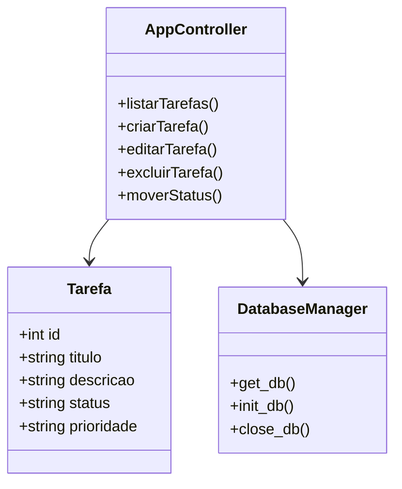

# Diagrama de Classes

```mermaid
classDiagram

class Tarefa {
    +int id
    +string titulo
    +string descricao
    +string status
    +string prioridade
}

class AppController {
    +listarTarefas()
    +criarTarefa()
    +editarTarefa()
    +excluirTarefa()
    +moverStatus()
}

class DatabaseManager {
    +get_db()
    +init_db()
    +close_db()
}

AppController --> Tarefa
AppController --> DatabaseManager
```
