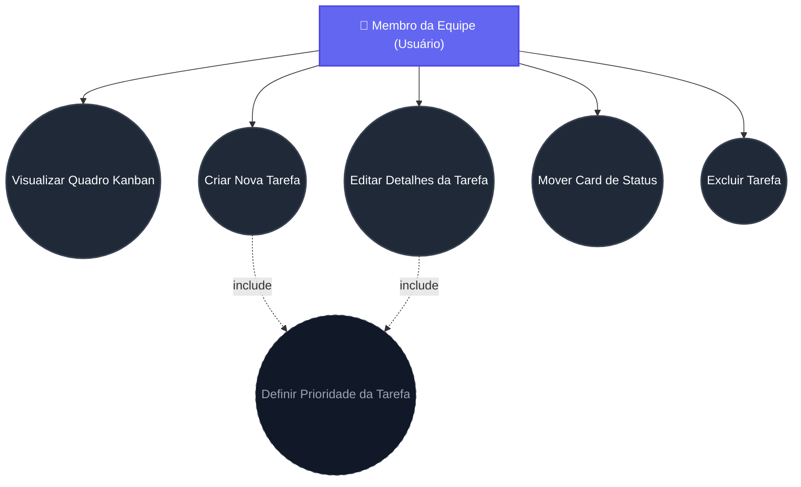
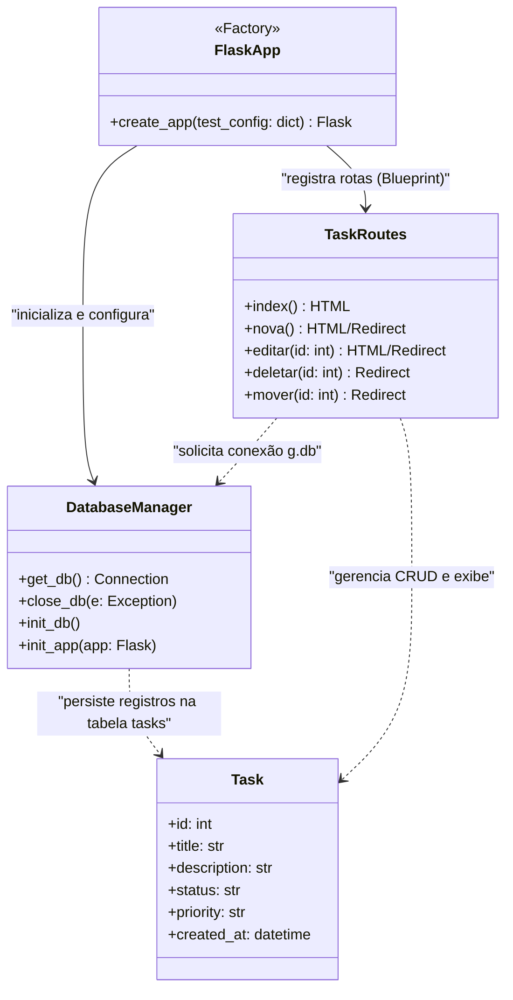

# Diagramas do Projeto - Engenharia de Software

Este documento contém a modelagem visual do sistema utilizando diagramas UML expressos em formato Mermaid.

---

## 1. Diagrama de Casos de Uso

O diagrama de casos de uso ilustra as interações entre o ator principal (Membro da Equipe) e as funcionalidades expostas pelo sistema de gerenciamento Kanban.

---

## 2. Diagrama de Classes

O diagrama de classes detalha a arquitetura lógica do sistema. Ele mostra a separação de responsabilidades entre a fábrica de aplicação (`create_app`), a conexão com o banco SQLite (`db.py`), as rotas controladoras (`app.py`), e a estrutura lógica do dado (`Task`).

